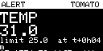
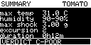

# Farm-to-Mandi Journey Logger — demo and design notes

Two nodes, no internet, no cloud, no phone.

- **Remote node** rides with the consignment: GPS, temperature, humidity, shock,
  RFID chain of custody, a CSV on a microSD card, three status LEDs.
- **Base node** stays at the farm: an OLED that lights up the moment something
  goes wrong on the road, and shows the end-of-journey verdict.

---

## 1. Run it

```powershell
pio run                       # builds both firmwares
$env:WOKWI_CLI_TOKEN = "..."  # free, from https://wokwi.com/dashboard/ci
python tools/lora_bridge.py
```

That starts both simulations and carries radio frames between them. The truck
side is driven by `scenario-remote.yaml`, so the whole journey — crop selection,
GPS fix, three custody scans, a heat excursion, a pothole, the summary — plays
out on its own.

To drive it by hand instead (this is the version to show judges):

```powershell
python tools/lora_bridge.py --scenario none
```

Or open the project in VS Code and press **F1 → Wokwi: Start Simulator** for the
truck node; the base node is a second project in [base_node/](../base_node/).

Individual pieces:

```powershell
wokwi-cli . --scenario scenario-remote.yaml --timeout 45000     # truck only
wokwi-cli base_node --scenario base_node/scenario-base.yaml \
          --timeout 9000 --screenshot-part oled1                # farm only
```

> Wokwi's free tier stops a run at 5 minutes of wall clock, and these
> simulations run slower than real time. Keep `--timeout` tight.

---

## 2. The two-minute demo script

| # | Do this | What the judge sees |
|---|---|---|
| 1 | Power on (start the sim) | Boot banner, then `--- SELECT CROP ---`. The amber LED blinks: the box is asking a question. |
| 2 | Tap **NEXT** to reach a crop, tap **OK** | `CROP SELECTED: TOMATO` with its limits printed in plain language. Leave it alone for 15 s and it starts anyway — the box never refuses to log. |
| 3 | Wait ~13 s | `GPS: first fix 13.2 s after power-on (constraint: within 120 s)` then `=== JOURNEY START ===`. Green LED. |
| 4 | Tap the RFID card at the reader | `CUSTODY: FARM uid=01:02:03:04 at 13.13657,78.12391 t+90s`, and a custody row lands in the CSV. |
| 5 | Drag the DHT22 temperature above 25 °C | Amber LED, `!! TEMP EXCURSION`, and **the farm OLED jumps to a red alert within a second**. |
| 6 | Spike the MPU6050 `accelZ` | Red LED, `!! SHOCK EXCURSION`, second alert at the farm, exact coordinates of the pothole. |
| 7 | Change the RFID card, tap again (×2) | Collection centre, then mandi. The farm OLED custody page fills in. |
| 8 | Press **OK** | Full summary on serial, the same summary on the farm OLED, and the entire CSV printed between `---BEGIN JOURNEY.CSV---` and `---END JOURNEY.CSV---`. |

The four required demonstrations map to steps 3, 5–6, 8 and 4 respectively.

### What the log looks like

```
seq,journey_s,utc_time,lat,lon,speed_kmph,sats,temp_c,hum_pct,shock_g,tilt_deg,status,custodian,event
1,2,06:01:00,13.13629,78.12646,16.7,9,18.0,90.0,0.00,0.0,OK,,
2,90,06:02:00,13.13657,78.12391,16.7,9,18.0,90.0,0.00,0.0,OK,FARM,CUSTODY_FARM
3,122,06:03:00,13.13686,78.12137,16.7,9,18.0,90.0,0.00,0.0,OK,FARM,
4,242,06:05:00,13.13743,78.11629,16.7,9,31.0,90.0,0.00,0.0,WARN,FARM,
5,243,06:05:00,13.13743,78.11629,16.7,9,31.0,90.0,0.00,0.0,WARN,FARM,TEMP_EXCURSION
...
9,486,06:09:00,13.13857,78.10612,16.7,9,31.0,90.0,3.00,0.0,ALERT,COLLECTION,SHOCK_EVENT
```

Rows land every two minutes **plus** an extra row at the exact instant of every
excursion and every custody scan. Waiting for the next scheduled row would blur
the one thing the log exists to prove: where it happened.

### What the farmer sees

 

---

## 3. Reading the LEDs

Count of the three metrics currently outside the selected crop's limits:

| Breaches | LED | Meaning |
|---|---|---|
| 0 | green | handling is fine for this crop |
| 1 | amber | one thing is out of band |
| 2 or 3 | red | the consignment is being damaged now |

Red also latches for three seconds after any jolt, so a pothole is still visible
to someone who glances at the box a moment later.

Nobody has to read a number to act on this.

---

## 4. Crop presets

| Crop | Temp | Humidity | Shock | Why |
|---|---|---|---|---|
| Tomato | 10–25 °C | 85–95 % | 2.0 g | bruises easily, chills below 10 °C |
| Onion | 0–30 °C | 60–75 % | 3.0 g | needs dry air, cracks when dropped |
| Banana | 13–28 °C | 85–95 % | 1.5 g | very soft, chills below 13 °C |
| Grapes | −1–22 °C | 85–95 % | 1.8 g | shatters off the bunch |
| Potato | 7–28 °C | 85–95 % | 3.0 g | hardy, greens in the heat |
| Chilli | 7–27 °C | 90–95 % | 2.0 g | wilts fast in dry heat |

`shock` is the acceleration deviation away from the 1 g a stationary box feels,
so it measures the jolt rather than gravity. Presets live in
[src/shared/crops.cpp](../src/shared/crops.cpp) — one line per crop.

---

## 5. Mandatory constraints

| Constraint | How it is met |
|---|---|
| CSV on microSD, human-readable | `/JOURNEY.CSV`, one header row, opens in Excel. Also printed to serial on demand, because Wokwi cannot hand you a file the firmware wrote. |
| LoRa base node operational and in range | Base node is a full second firmware with its own diagram; it renders every frame type. In simulation the frames travel over the bridge instead of the air (see §7). |
| GPS fix within 2 minutes of power-on | Time-to-first-fix is measured from boot and printed: `GPS: first fix 13.2 s after power-on`. The state machine also gives up after 120 s and logs without position rather than stalling. |
| Battery ≥ 8 hours | See §8. |
| Logging starts on power-on, runs to power-off | Crop selection auto-confirms after 15 s; there is no state in which the device sits idle. |
| Alert on any threshold crossing | Edge-triggered per metric, sent immediately, and re-armed only after the value recovers past a margin — so one long hot stretch is one alert, not hundreds. |

---

## 6. Wiring

### Remote node

| Function | GPIO |
|---|---|
| GPS UART1 RX (NEO-6M TX) | 16 |
| NMEA generator UART2 TX — **simulation only**, looped back to 16 | 17 |
| DHT22 data | 4 |
| MPU6050 SDA / SCL | 21 / 22 |
| VSPI SCK / MISO / MOSI (shared) | 18 / 19 / 23 |
| microSD CS | 5 |
| RC522 SDA(CS) / RST | 15 / 13 |
| LED green / amber / red (220 Ω) | 25 / 26 / 27 |
| Button NEXT / OK (to GND, `INPUT_PULLUP`) | 32 / 33 |
| LoRa NSS / RST / DIO0 — **real hardware only** | 14 / 17 / 35 |

GPIO17 is the one dual-use pin: the NMEA feed in simulation, LoRa RST in the
field. The two never exist in the same build.

### Base node

SSD1306 on I2C 21/22 at 0x3C, PAGE button on 32, alert LED on 25, LoRa on the
same VSPI pins as the remote node.

---

## 7. What is simulated, and what is not

Wokwi has no GPS part and no LoRa part, and it runs one firmware per simulation.
Exactly two things change under `-DSIM_BUILD=1`; everything else is the same
code in the field and on screen.

| | Simulation | Real hardware (`SIM_BUILD=0`) |
|---|---|---|
| GPS | [`sim_gps.cpp`](../src/remote/sim_gps.cpp) generates NMEA on UART2 (GPIO17), wired back to GPIO16 in `diagram.json`. Real bytes over a real UART, checksummed, parsed by TinyGPS++. | NEO-6M TX into GPIO16. The parsing code is untouched. |
| LoRa | [`radio.cpp`](../src/shared/radio.cpp) writes the frame to UART0 with a tag; `tools/lora_bridge.py` carries it to the other simulation. | `LoRa.beginPacket()` / `parsePacket()` at 865 MHz, SF10. |

Everything above `radioSend()` — thresholds, excursion logic, the frame format,
the OLED, the CSV — is production code. The route is a real one: Kolar farm gate
→ NH-75 → Hoskote collection centre → KR Puram → Yeshwanthpur APMC, about 65 km.

### Time compression

`TIME_SCALE=60` in [platformio.ini](../platformio.ini) makes one wall second
equal one journey minute, so a 4-hour trip demos in about four minutes. It does
**not** change the log interval: rows are always two minutes of journey time
apart, and the timestamps in the CSV are the honest journey clock. Set
`TIME_SCALE=1.0f` for field hardware.

---

## 8. Eight-hour battery budget (field build)

| Rail | Current | Notes |
|---|---|---|
| ESP32 active, WiFi/BT off | 45 mA | 240 MHz, most of the time idle in `loop()` |
| NEO-6M tracking | 25 mA | continuous, so the fix is never lost |
| MPU6050 | 4 mA | 50 Hz sampling |
| DHT22 | 1 mA | one reading every 2 s |
| RC522 idle | 12 mA | soft power-down between polls |
| microSD write burst | 40 mA for ~30 ms every 2 min | negligible average |
| SX1276 TX burst | 120 mA for ~100 ms per alert | negligible average |
| **Average** | **~90 mA** | |

A single 18650 at 2600 mAh gives 2600 / 90 ≈ **28 hours**, so 8 hours holds with
a 3× margin even on a tired cell. Two cells in parallel, a TP4056 charger and an
AMS1117 rail is the whole power design. Dropping the ESP32 to 80 MHz between
samples roughly doubles it again.

---

## 9. Repository layout

```
platformio.ini          two environments: remote and base
wokwi.toml              remote node    (VS Code F1 > Wokwi: Start Simulator)
diagram.json            remote node wiring
scenario-remote.yaml    automated full journey
base_node/              farm node: its own wokwi.toml, diagram, scenario
src/shared/             crops, frame format, radio abstraction, journey types
src/remote/             sensors, SD log, RFID custody, simulated GPS, state machine
src/base/               OLED screens and the received-state model
tools/lora_bridge.py    carries radio frames between the two simulations
```
